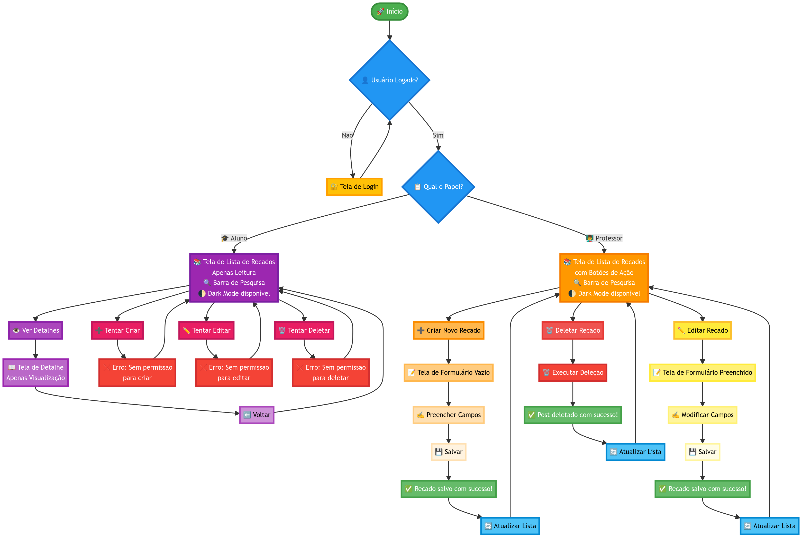

# BlogEducaMais

Projeto de blog educacional desenvolvido como parte do **Tech Challenge**, utilizando a plataforma **OutSystems (low-code)**.

O sistema foi projetado para simular um ambiente real de comunicação educacional, permitindo que **professores publiquem recados** e **alunos visualizem os conteúdos**, respeitando regras claras de autenticação, autorização e separação de responsabilidades.

---

## Visão Geral

O BlogEducaMais é uma aplicação web educacional com **controle de acesso por papéis (roles)**, desenvolvida com foco em:

- organização lógica do sistema
- segurança de acesso
- experiência do usuário
- clareza no fluxo funcional

Este repositório **não contém código-fonte tradicional**, pois o projeto foi desenvolvido integralmente na plataforma **OutSystems**.  
Aqui estão centralizados os **artefatos técnicos**, **documentação**, **fluxo do sistema** e **material demonstrativo** do projeto.

---

## Funcionalidades

### 👨‍🏫 Perfil Professor
- Criar novos recados
- Editar recados existentes
- Excluir recados
- Visualizar lista completa de recados
- Barra de pesquisa
- Modo escuro (Dark Mode)

### 👨‍🎓 Perfil Aluno
- Visualizar lista de recados
- Acessar detalhes do recado (somente leitura)
- Barra de pesquisa
- Modo escuro (Dark Mode)
- Tentativas de criação, edição ou exclusão são bloqueadas por regra de negócio

---

## Controle de Acesso e Segurança

- Autenticação e autorização gerenciadas pelo **sistema de Roles do OutSystems**
- Validações críticas aplicadas na **camada lógica**, garantindo que ações indevidas sejam bloqueadas mesmo em tentativas manuais
- Separação clara entre permissões de aluno e professor

---

## Fluxo do Sistema

O fluxograma abaixo representa:

- fluxo de autenticação
- verificação de usuário logado
- identificação do papel do usuário
- permissões e restrições de cada perfil
- ações permitidas e bloqueadas no sistema

---

## Tecnologias Utilizadas

- OutSystems (Low-code)
- OutSystems Service Studio
- OutSystems Cloud
- JavaScript (interações e Dark Mode)
- CSS (customizações visuais)
- Controle de acesso por Roles

---

## Vídeo Demonstrativo

📺 Demonstração completa do projeto disponível no YouTube:  
👉 https://youtu.be/neUk1VxwwbE

O vídeo apresenta:
- visão geral da aplicação
- fluxo de login
- diferenciação de permissões entre aluno e professor
- funcionalidades principais do sistema

---

## Documentação

A documentação técnica completa do projeto está disponível neste repositório:

📄 **Documentação_do_Projeto_BlogEducaMais.pdf**

---

## Observação Importante

Este repositório tem caráter **documental e demonstrativo**, servindo como evidência técnica do projeto desenvolvido na plataforma OutSystems, incluindo análise de requisitos, fluxo funcional e validações de negócio.

---

## Autor

## Equipe do Projeto (Tech Challenge)

Projeto desenvolvido para fins acadêmicos e portfólio, com foco em arquitetura lógica, segurança e organização de sistemas.

**Integrantes:**
  
- Igor Carvalho  
  GitHub: https://github.com/igorcarvalhodevs    

- Igor Dutra Pereira  
  GitHub: https://github.com/IgorDutraPereira

- Arthur Cruz  
  GitHub: https://github.com/ArthurCruzADS

- Henrique Rodrigues  
  GitHub: https://github.com/henri-ralmeida

- Vincenzo Rivelli  
  GitHub: https://github.com/Vint000
